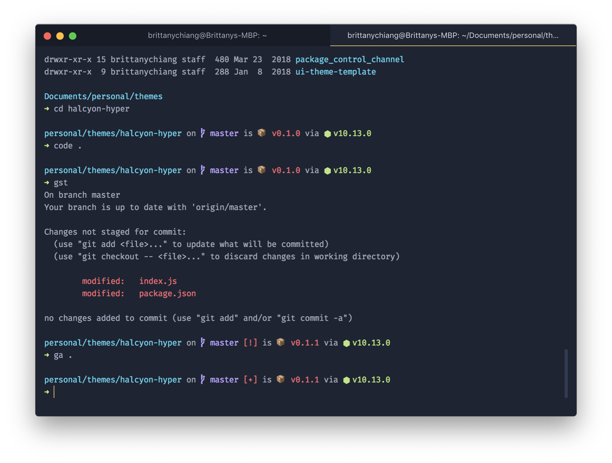

# Halcyon Theme for Hyper



## Installation

1. Open Hyper's preferences with `Cmd +`, (or manually at `~/.hyper.js`)
2. Update your list of plugins to include `halcyon-hyper`, like this:

```js
plugins: [`hyper-halcyon-theme`];
```

3. Fully reload Hyper `Cmd + Shift + R` or `View > Full Reload`

I'm currently using the [Spaceship Prompt](https://github.com/denysdovhan/spaceship-prompt) for [ZSH](http://zsh.org/)
